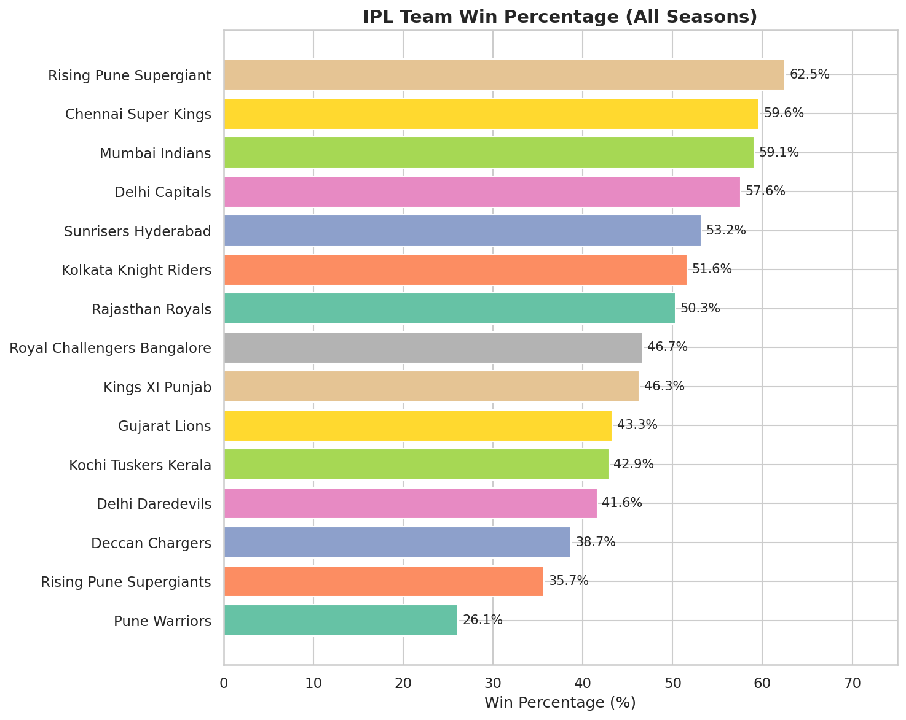
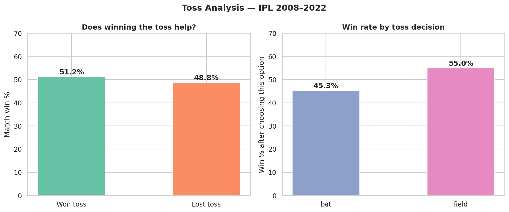
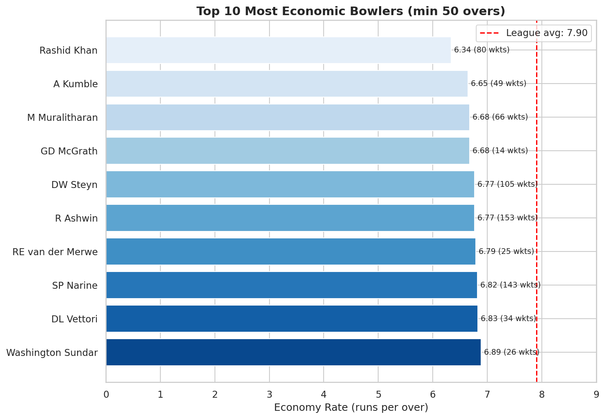
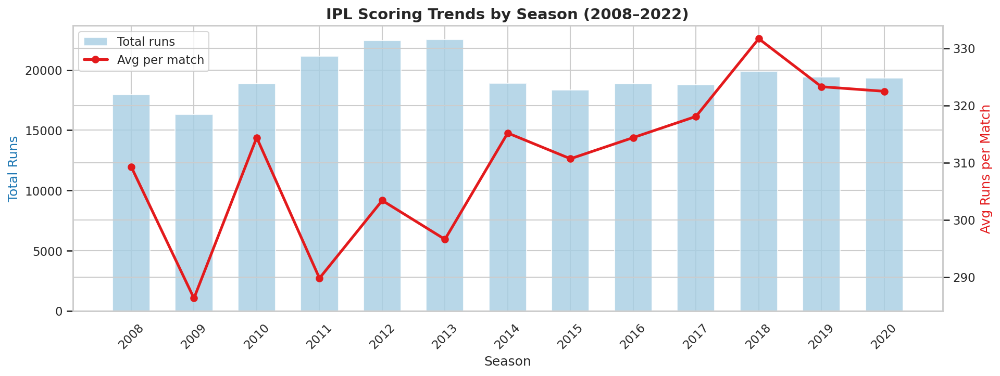
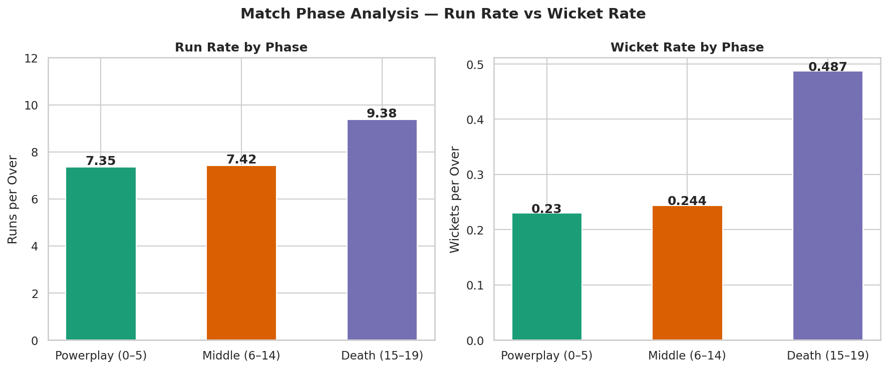

# 🏏 IPL Analytics Pro — EDA + Interactive Dashboard


> **Live Dashboard →** [ipl-eda-analysis-3.onrender.com](https://ipl-eda-analysis-3.onrender.com)  
> A full-stack data analytics project built with Python, covering 13 IPL seasons (2008–2020), 816 matches, and 193,468 ball-by-ball deliveries.

---

## 📌 Project Overview

This project performs end-to-end exploratory data analysis on IPL cricket data, extracting 6 key insights through statistical analysis and visualization. The findings are presented both as a static Jupyter notebook EDA report and a fully interactive multi-page dashboard deployed on the web.

**Built as part of a data analytics freelance portfolio — targeting clients on Upwork, Fiverr, and Internshala.**

---

## 🚀 Live Dashboard

The interactive dashboard is built with **Plotly Dash** and deployed on **Render**.

**Features:**
- 4-page navigation: Overview · Team Analysis · Player Stats · Match Phases
- Season filter dropdown that updates all charts simultaneously
- Hover tooltips on every data point
- Dark theme with gold/teal/purple accent palette
- KPI cards, dual-axis charts, scatter bubbles, radar chart, heatmap

**Pages:**

| Page | Charts |
|------|--------|
| Overview | KPI cards · Season scoring trends · Toss donut · Decision win rate |
| Team Analysis | Win/loss stacked bars · Top venues · Toss→win rate by team |
| Player Stats | Top 15 batsmen · Economic bowlers · Runs vs SR scatter |
| Match Phases | Run rate · Wicket rate · Radar comparison · Over-by-over heatmap |

---

## 📊 EDA Notebook — Key Findings

The Jupyter notebook (`notebooks/ipl_eda.ipynb`) covers 6 insights across 8 sections:

### Insight 1 — Team Win Percentage


CSK (59.6%) and MI (59.1%) are the most **consistently dominant teams** across 13 seasons. Rising Pune Supergiant's 62.5% is misleading — they only played 2 seasons.

---

### Insight 2 — Toss Analysis


**Toss advantage is a myth** — toss winners win only 51.2% of matches, barely better than a coin flip. However, teams choosing to **field first win 55%** vs 45.3% when batting first. Fielding is the smarter toss choice.

---

### Insight 3 — Most Economic Bowlers


**Rashid Khan leads economy at 6.34** runs/over with 80 wickets. 9 of the top 12 most economic bowlers are spinners, confirming spinners control middle overs in T20. League average is 7.90.

---

### Insight 4 — Season Scoring Trends


Average runs per match grew from ~310 in 2008 to ~330 post-2018. **2009 was an outlier** (hosted in South Africa due to elections) with the lowest average in IPL history (~288 RPM).

---

### Insight 5 & 6 — Match Phase Analysis


Death overs (15–19) have a **run rate of 9.38** — 27% higher than powerplay (7.35). Wicket rate also **doubles** in death overs (0.487 vs 0.23), making death bowling the most critical and scarce skill in IPL auctions.

---

## 🖥️ Dashboard Screenshots

### Overview Page


### Team Analysis


### Player Stats


### Match Phases


---

## 🛠️ Tech Stack

| Layer | Tools |
|-------|-------|
| Data processing | Python · pandas · numpy |
| Static charts | matplotlib · seaborn |
| Interactive dashboard | Plotly · Dash |
| Deployment | Render (free tier) · gunicorn |
| Version control | Git · GitHub Codespaces |

---

## 📁 Repository Structure

```
ipl-eda-analysis/
├── data/
│   ├── IPL Matches.csv          # 816 matches, 2008–2020
│   └── IPL Ball-by-Ball.csv     # 193,468 deliveries
├── notebooks/
│   └── ipl_eda.ipynb            # Full EDA with 6 insights
├── charts/                      # Exported static chart PNGs
├── screenshots/                 # Dashboard & chart screenshots
├── app.py                       # Dash dashboard application
├── requirements.txt             # Python dependencies
├── render.yaml                  # Render deploy config
└── README.md
```

---

## ⚡ Run Locally

```bash
# Clone the repo
git clone https://github.com/Jaividhyarthi/ipl-eda-analysis.git
cd ipl-eda-analysis

# Install dependencies
pip install -r requirements.txt

# Run the dashboard
python app.py
# Open http://localhost:8050
```

---

## 📈 Dataset

- **Source:** [IPL Complete Dataset — Kaggle](https://www.kaggle.com/datasets/patrickb1912/ipl-complete-dataset-20082020)
- **Matches:** 816 across 13 seasons (2008–2020)
- **Deliveries:** 193,468 ball-by-ball records
- **Teams:** 15 (including defunct franchises)
- **Venues:** 36 stadiums

---

## 👤 Author

**Jaividhyarthi**  
B.Tech AI & Data Science — SRM Valliammai Engineering College, Chennai  
IV Semester · Data Analytics Portfolio Project

---

## 📬 Hire Me

Looking for data analysis, dashboards, or EDA reports?  
Find me on **Fiverr** · **Upwork** · **LinkedIn**

*This project is part of a 5-project freelance portfolio in data analysis and visualization.*
